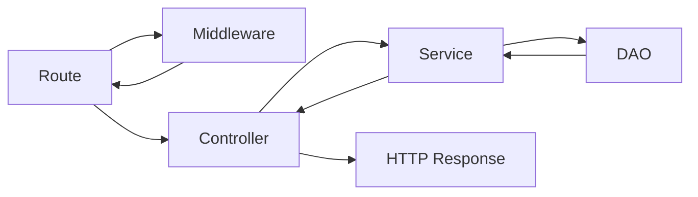

<p align="center">
  <a href="https://www.php.net/" target="_blank"></a>
</p>

# Teste Backend - ACSoftware

Desenvolvimento de uma API RESTful para Gerenciamento de Lista de Tarefas (Todo List)


## 🚀 Iniciando

Estas instruções permitirão que você obtenha uma cópia do projeto em execução em sua máquina local para fins de desenvolvimento e teste.

### 📋 Pré-requisitos

O que você precisa para instalar o software e como instalá-lo?

|Technologies    |PHP                            |Composer                     |
|----------------|-------------------------------|-----------------------------|
|Version         |`8.2.18`                        |`2.7.4`                      |

## 🔧 Instalação

1. Clone o repositório:
```
git clone https://github.com/JosePedro-22/Teste-apiTodoList.git
```
2. Navegue até o diretório do projeto:
```
cd Teste-apiTodoList
```
3. Instale dependências:
```
composer install
```

## 🎲 As principais decisões técnicas que tomei:

* Linguagem: PHP é amplamente utilizado e possui uma grande comunidade de desenvolvedores e recursos disponíveis.
* Arquitetura: optei por aplicá-la de forma simples e organizar o código em diferentes camadas. Isso ajuda a manter uma separação clara de responsabilidades e facilita a manutenção e a escalabilidade dos aplicativos.
* Validação de dados: A validação de dados foi implementada para garantir que os dados recebidos pela API estejam corretos e completos. Isso ajuda a evitar erros e problemas de segurança.
* Saída da API: formato JSON.

## 🔧 Instruções para Rodar o Projeto
1. Rode o script sql no mysql para montar o banco de dados 
2. rode o projeto:
```
php -S localhost:8000 -t public
```
3. Use o Postman ou Eclipse ou algum de sua preferencia para acessar as rotas:


4. Olhe no swagger os Json de Entrada para colocar no Postman
```
Obs: Para acessar as rotas de Usuarios não é preciso está autenticado, mas
as rotas de tasks é preciso que o usuario se autentique
```
4. Rodar Teste
```
./vendor/bin/phpunit tests
```
você tambem pode rodar test unicamente
```
./vendor/bin/phpunit tests/app/controllers/TaskTest.php
```
ou

```
./vendor/bin/phpunit tests/app/controllers/UserTest.php
```
## 🎲 Sobre

|Name Branch     |Description                                                  |
|----------------|-------------------------------------------------------------|
|master          |projeto base, implementação do algoritmo para criação de Tarefa|

#### Diagramas do caminho da solicitação à resposta


## 🛠️ Feito com

* [PHP](https://www.php.net/) - A linguagem usada
* [Composer](https://getcomposer.org/) - Gerenciador de Dependências

## ✒️ Autor

* **José Pedro** - *Development / Documentation* - [Developer](https://www.linkedin.com/in/josepedro-sm/)
